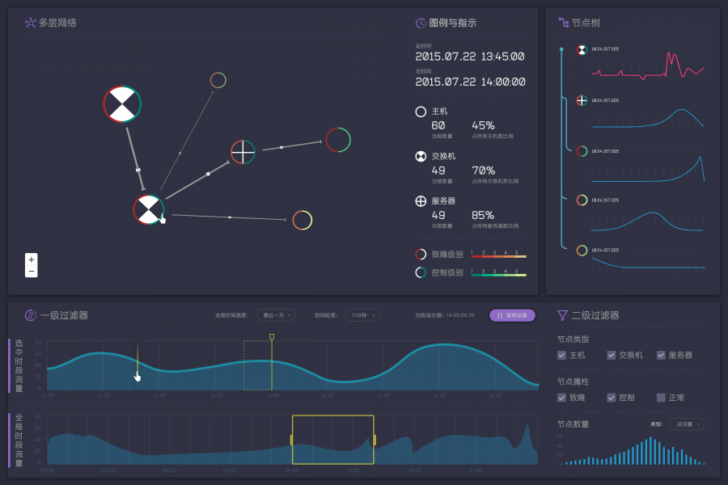
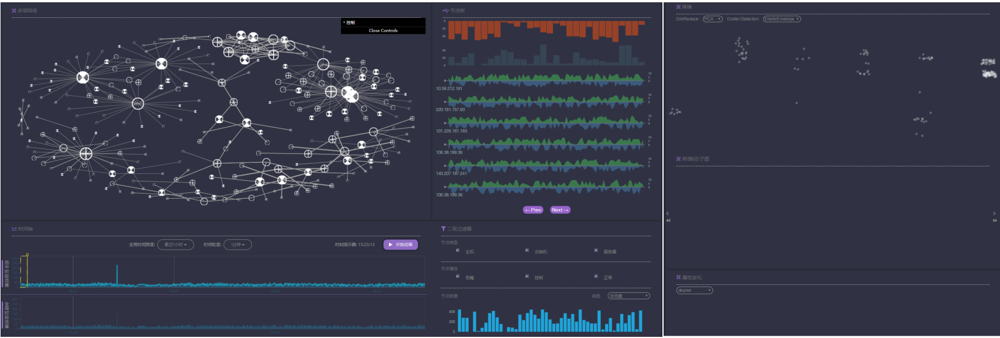

## 界面
#### 第一期界面

#### 现在的界面
##### 主要用于大屏展示

## 安装
* `npm install` 或者 `cnpm install`

## 开发

##### 前端开发自定义配置
* 配置文件: `config.custom.js`
* 配置文档: https://github.com/skyeyefront/FrontEnd-Frame2

##### 项目本地开发配置
* 在根目录创建文件`local.config.js`
* 配置前后端参数：
```
module.exports = {
        client: {
            devServer: {
                host: 'your host',
                port: 'your port',
                proxy: 'your proxy'
            }
        },
        server: {
            host: 'your host',
            port: 'your port',
            db: 'your db'
        }
}
```
* 启动服务 `npm run serv`
* 实时编译后端代码 `npm run serverDev`
* 实时编译前端代码 `npm run clientDev`
* 生成API DOC `npm run apidoc`

## 上线
* 需要全局安装`pm2`
* 在根目录创建文件`online.config.js`
* 配置后端参数：
```
module.exports = {
        host: 'your host',
        port: 'your port',
        db: 'your db'
}
```
* 编译前后端代码且启动服务 `npm run start`
* 其它命令：
    * 启动或重启服务 `npm run startService`
    * 停止服务 `npm run stopService`
    * 编译前后端代码 `npm run build`
    * 编译后端代码 `npm run serverPro`
    * 编译前端代码 `npm run clientPro`


// 将应用更新到db上的操作流程
1. 更新后台服务
    将src文件更新到db network_security
    * 编译后端代码 `npm run serverPro`
    * 启动或重启服务 `npm run startService`
    * 停止服务 `npm run stopService`
2. 更新前端
    发布的时候，需要将编译好的前端代码public内，更新到db 的networkSecurity上
    前端代码编译的时候，需要去修改服务器的访问路径，在访问api前面，加上network_security
